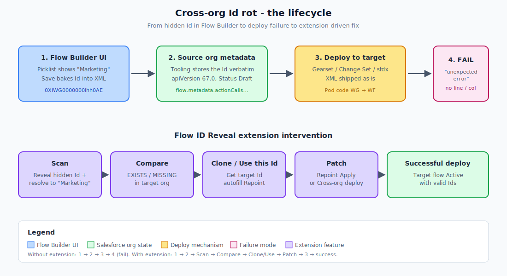

# 01. Mental model

The problem this extension addresses has three layers. The whole guide makes sense if you hold these in mind.

## Layer 1. Flow Builder hides record Ids behind friendly labels

When you configure a Flow action in Flow Builder and pick "Marketing" from a Communication Subscription dropdown, the UI shows the word `Marketing`. Behind it, Salesforce writes the record Id `0XlWG0000000Ihh0AE` into the flow's underlying metadata.

You cannot see this Id anywhere in the Flow Builder UI. The dropdown shows the human label. The save shows the human label. The version diff in Setup shows the human label.

To find the Id, you have to:

- Retrieve the flow source via SFDX and open the `.flow-meta.xml`, or
- Query the Tooling API for `SELECT Metadata FROM Flow WHERE Id='...'` and search the JSON, or
- Run this extension's Scan tab, which surfaces every Id in seconds with the JSON path showing where each one sits

The first two paths are slow and require leaving the browser. The third path is the point of this extension.

## Layer 2. Record Ids are pod-specific

A Salesforce 18-character record Id is not a content hash. It is a sequential identifier assigned by the org's database when the record is created. Two orgs that have logically equivalent records (both have a Communication Subscription named "Marketing") will assign them different Ids.

Salesforce sandboxes refresh from production carry forward production Ids for some objects, but only at the moment of refresh. Custom record creation after the refresh diverges. Different sandboxes refreshed at different times will diverge. Sibling orgs (two sandboxes off the same prod) usually agree at the time of last common refresh. Orgs on different prod tenants never agree.

The Id `0XlWG0000000Ihh0AE` is a CommSubscription in some org. In another org, that exact 18-char string almost certainly does not exist. The equivalent record in that other org has a different Id: `0XlWF0000000GrB0AU`, or `0XlXY0000001ABCDEF`, or whatever the other org's sequence produced.

The middle two characters (`WG`, `WF`, `XY` above) are the **pod code**. Pod code is hostname-derived. SilverChef on pod `WG` versus a different sandbox on pod `WF` is a guaranteed Id mismatch on every record.

## Layer 3. Deploy moves the metadata, not the references

When Gearset, Change Sets, or sfdx deploys a flow from org A to org B, the deploy moves the flow's XML bytes. The XML still says `0XlWG0000000Ihh0AE`. Org B has no such record. Salesforce's deploy validator runs, finds the reference unresolvable, and rejects the deploy.

The rejection message is famously unhelpful. A common shape:

```
An unexpected error occurred. Please include this ErrorId if you contact
support: 427833057-64155 (-78598139)
```

No line number. No field name. No reference text. The error is in the metadata reference resolver, which knows the deploy failed but does not surface the specific failing reference cleanly. The pipeline says "deploy failed" and you spend hours grepping XML.

## The extension's response

The extension addresses each layer.

| Layer | Extension feature |
|---|---|
| 1. Hidden Ids | **Scan** + **Inspect → Source** surface every Id with JSON path. |
| 2. Pod-specific Ids | **Compare → Per-Id check** identifies which Ids exist in target and which do not. **Clone → target** auto-creates missing records. **Use this Id** captures equivalent target Ids. |
| 3. Deploy fails opaquely | **Compare → Draft collision check** + **Audit → Pre-deploy** surface deploy-blocking conditions before the pipeline runs. **Patch → Cross-org deploy** does the deploy in-extension with structured error reporting. |

## A second class of Id: CMS content keys

Form-triggered flows reference a CMS form by its **content key**, a 28-character GUID like `MCP4JHBDDOEBHHJKMUYCEKF4YHGY`. The content key is not a sObject record Id (different length, different prefix space, different namespace). It is a CMS-layer identifier assigned when the form is published. Like sObject Ids, it is org-specific.

The cross-org rot for CMS content keys works the same way as for sObject Ids, but the resolution path is different. You cannot REST POST a copy of a CMS form. You publish it manually in target's CMS workspace, get the new content key, and patch the flow's `<form>` reference. The extension's **Inspect → CMS Form** tab automates the patch step once you have the new key.

See [Chapter 13](13-form-bound-flow-constraints.md) and [Chapter 15](15-cms-form-helper.md) for the full CMS lifecycle.

## A third class: form-binding uniqueness

Salesforce enforces another constraint on form-triggered flows: a given form can be bound to **at most one Draft flow version at a time**. If org B already has a Draft for this flow, your deploy of a new Draft from source fails with:

```
The form you selected is already associated with a draft flow version.
You can't associate a form to more than one draft flow version.
```

This is independent of Id rot. You fix it by activating or deleting the existing target Draft first. The extension's **Compare → Draft collision check** detects this before deploy. The extension's **Patch → Lifecycle** subtab gives one-click Activate / Delete in either org.

## What the extension does not do

It is not a deploy tool. The extension's Cross-org deploy works for one-flow MDAPI deploys, but it does not replace Gearset, sfdx, or Change Sets for multi-component pipelines. It works alongside those tools by fixing the flow contents before the pipeline runs.

It is not a Flow Builder replacement. It does not edit a flow's logic, add elements, rewire connectors, or change semantics. It only swaps Ids and literals inside the existing metadata.

It is not a CMS publishing tool. CMS forms still need to be authored and published in Salesforce CMS. The extension only patches the reference once the target form exists.

It is not an Apex / metadata clone tool. System-managed metadata types (ApexClass, Profile, PermissionSet, FlowDefinition) ship via MDAPI / Tooling API only. The extension's Clone-to-target works for data-layer records, not metadata.

## The picture



## References

- [Salesforce sObject Id structure](https://developer.salesforce.com/docs/atlas.en-us.api.meta/api/sforce_api_concepts_record_ids.htm)
- [Tooling API Flow object](https://developer.salesforce.com/docs/atlas.en-us.api_tooling.meta/api_tooling/tooling_api_objects_flow.htm)
- [Marketing Cloud Growth Form Submission flows](https://help.salesforce.com/s/articleView?id=sf.mcg_form_handler_flow.htm)
- [Salesforce CMS API overview](https://developer.salesforce.com/docs/atlas.en-us.connectApi.meta/connectApi/connect_resources_cms.htm)
