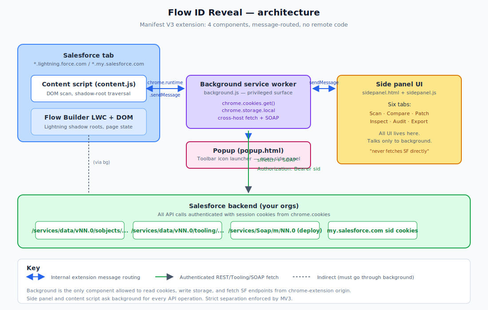

# 02. Architecture

A Chrome Manifest V3 extension with four executable components.



## The four components

| Component | Runs in | Responsibility |
|---|---|---|
| **Content script** (`src/content.js`) | Every Salesforce page (lightning.force.com, my.salesforce.com, etc.) | DOM scanning, shadow-root traversal, Tooling API metadata fetch via background, sending results to side panel via background. |
| **Background service worker** (`src/background.js`) | Extension worker context | All REST + Tooling + Metadata API calls. Reads HttpOnly sid cookies via `chrome.cookies`. Storage CRUD for Id mappings. Cross-tab routing. |
| **Side panel** (`src/sidepanel.html` + `sidepanel.js`) | Chrome's side panel area | All user interaction. Six top tabs, each with subpanels. Sends messages to background, never fetches Salesforce directly. |
| **Popup** (`src/popup.html` + `popup.js`) | Toolbar icon click | Tiny launcher: opens the side panel or runs a quick console-logged scan. |

Manifest V3 enforces strict separation of concerns. The content script cannot use `chrome.cookies`, the side panel cannot run code in a SF tab, the background worker is event-driven and idle most of the time. Every workflow crosses these boundaries via `chrome.runtime.sendMessage`.

## Why this split

Three reasons drive the split.

### 1. Cookies are HttpOnly. Only background can read them

The Salesforce session token (`sid` cookie) is HttpOnly on `*.my.salesforce.com`. Page JavaScript cannot read it via `document.cookie`. Only an extension background script with the `cookies` permission can read HttpOnly cookies via `chrome.cookies.get()`. Without this, the extension cannot authenticate any API call.

See [Chapter 03](03-session-model.md) for the full session model and why the lightning.force.com origin cannot make REST calls directly.

### 2. CORS blocks lightning.force.com from calling my.salesforce.com

Even if a page script could read the sid, `fetch('https://...my.salesforce.com/services/data/...')` from a `*.lightning.force.com` page is blocked by browser CORS. The Salesforce response does not include the right `Access-Control-Allow-Origin` header for cross-subdomain.

Background scripts run in the extension origin (`chrome-extension://<id>`), which is whitelisted via the manifest's `host_permissions`. Fetches from background bypass the CORS preflight rejection entirely.

### 3. Flow Builder is built on LWC with shadow DOM

Lightning Web Components render into shadow roots. A flat `document.querySelectorAll('*')` does not traverse shadow boundaries. Most Flow Builder UI elements (combobox option values, action input panels, the canvas) live inside shadow roots up to 5 levels deep.

The content script's `walkAll` generator descends into every open shadow root recursively. Closed shadow roots are unreachable and the extension falls back to text-content scraping on the host element.

For most cases, the Tooling API path bypasses the DOM entirely (see Chapter 06), but the shadow-aware DOM scan still has value on non-Flow Setup pages.

## Message flow for a Scan

This trace shows what happens when you click **Scan active SF tab** in the side panel.

```
Side panel JS               Background SW              Content script (SF tab)
─────────────────           ─────────────             ──────────────────────
  sendBg("scan-current")  →
                            findSfTab()
                            chrome.tabs.sendMessage()  →
                                                          scanDom()        // shadow-aware
                                                          scanFlow()
                                                            ↓
                                                          bg("sf-tooling-query")  →
                                                                              fetch ...my.salesforce.com
                                                                                with sid from cookies
                                                                              ←
                                                          parse JSON, extract Ids
                                                          ← merge DOM + flow Ids
                            ←  sendResponse
                            sendResponse to side panel
  ←  resp.result.results
  render scan table
```

The full message round-trip is four hops. Each direction is async. The side panel does not wait on background, which does not wait on content. All three components stay responsive.

## Message kinds

Every message has a `kind` discriminator. Current set as of v0.5.2:

| Kind | Direction | Purpose |
|---|---|---|
| `ping`, `scan`, `resolve`, `raw-flow` | side panel → bg → content | Content-script operations |
| `current-tab`, `list-sf-tabs`, `list-sf-cookies` | side panel → bg | Tab/cookie discovery |
| `scan-current`, `resolve-current`, `ping-current` | side panel → bg | "Find SF tab and proxy" wrappers |
| `resolve-in-tab` | side panel → bg → specific content | Cross-tab compare |
| `sf-tooling-query`, `sf-data-query` | side panel → bg | SOQL via Tooling/Data API |
| `sf-sobject-get`, `sf-sobject-post`, `sf-sobject-describe` | side panel → bg | REST sobject CRUD |
| `sf-flow-get`, `sf-flow-update`, `sf-flow-delete` | side panel → bg | Flow record CRUD |
| `sf-flowdef-update` | side panel → bg | Activate/Deactivate via FlowDefinition |
| `sf-md-deploy`, `sf-md-deploy-status` | side panel → bg | MDAPI SOAP deploy + poll |
| `maps-read`, `maps-write` | side panel → bg | Org-pair Id mapping persistence |
| `api-version-get`, `api-version-set`, `api-version-detect` | side panel → bg | API version negotiation |

All handlers in `background.js` follow the same pattern: derive `apiHost` from `originHost`, read sid from cookies, call the typed helper (`toolingQuery`, `sfFetch`, etc.), return `{ ok, apiHost, result }`.

## File layout

```
flow-id-reveal/
├── manifest.json
├── README.md
├── LICENSE
├── icons/
│   ├── icon-16.png    # toolbar size (uses minimalist magnifier)
│   ├── icon-32.png    # toolbar size (uses minimalist magnifier)
│   ├── icon-48.png    # extension card (full concept icon)
│   └── icon-128.png   # extension card + web store (full concept icon)
└── src/
    ├── background.js  # service worker — all SF API calls live here
    ├── content.js     # runs on every SF page — DOM scan + Tooling proxy
    ├── popup.html     # toolbar dropdown
    ├── popup.js
    ├── sidepanel.html # six-tab side panel
    ├── sidepanel.css
    ├── sidepanel.js   # tab controllers, all UI logic
    └── utils/
        └── id-patterns.js  # SF Id prefix dictionary + classifier (mirrored in content.js)
```

The `utils/id-patterns.js` dictionary is mirrored verbatim in `content.js` so the content script does not need module imports (MV3 content scripts are not ES modules by default). Keep both copies in sync when adding prefixes.

## Permissions in manifest

```json
"permissions": ["activeTab", "scripting", "storage", "sidePanel", "tabs", "cookies"],
"host_permissions": [
  "https://*.lightning.force.com/*",
  "https://*.my.salesforce.com/*",
  "https://*.force.com/*",
  "https://*.salesforce.com/*",
  "https://*.salesforce-setup.com/*",
  "https://*.cloudforce.com/*"
]
```

| Permission | Why |
|---|---|
| `cookies` | Read HttpOnly sid from `*.my.salesforce.com` |
| `tabs` | List + query SF tabs across windows |
| `storage` | Persist org-pair Id maps + API version overrides |
| `sidePanel` | Open side panel from popup or toolbar click |
| `scripting` | Quick-scan path runs `console.log` injection from popup |
| `activeTab` | Activate on user click without per-host prompts |
| `host_permissions` | Cross-host fetch from background (REST + Tooling + MDAPI) |

No remote code, no analytics, no telemetry endpoint. Everything happens in the user's browser against the orgs they are logged into. See [Chapter 21](21-privacy-and-security.md).

## What you cannot do from where

- **From a content script:** cannot read cookies, cannot call `chrome.cookies`, cannot open the side panel.
- **From the side panel:** cannot fetch Salesforce directly (CORS), cannot read cookies. Must go through background.
- **From background:** cannot interact with page DOM. Must send a message to a content script.
- **From popup:** technically can use most APIs, but lifecycle is too short for anything async. Use it as a launcher only.

## References

- [Chrome Manifest V3 overview](https://developer.chrome.com/docs/extensions/develop/migrate/what-is-mv3)
- [Service workers in Chrome extensions](https://developer.chrome.com/docs/extensions/develop/concepts/service-workers)
- [Side Panel API](https://developer.chrome.com/docs/extensions/reference/api/sidePanel)
- [chrome.cookies API](https://developer.chrome.com/docs/extensions/reference/api/cookies)
- [Shadow DOM and LWC](https://developer.salesforce.com/docs/component-library/documentation/en/lwc/lwc.create_components_intro)
